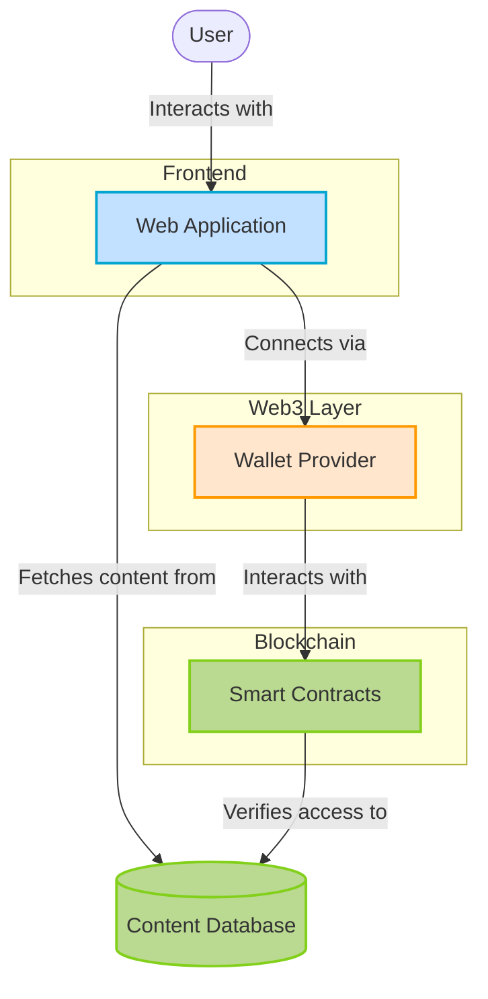
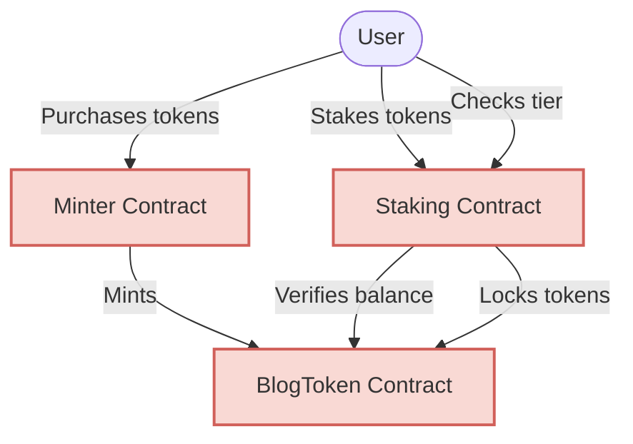
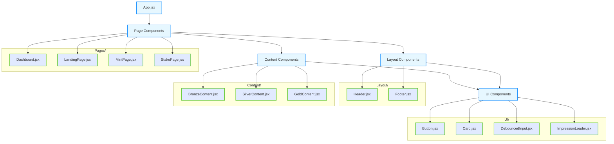
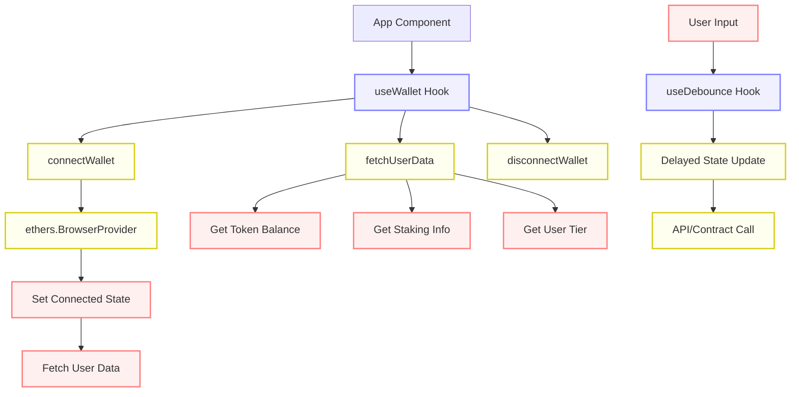
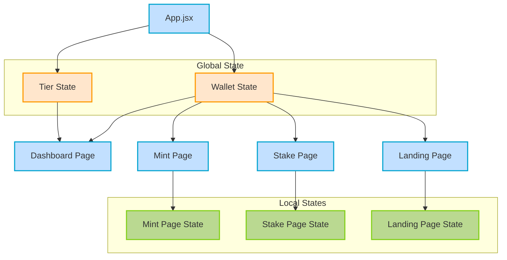
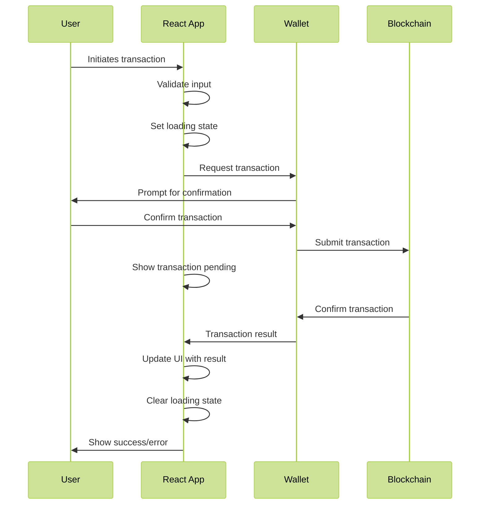
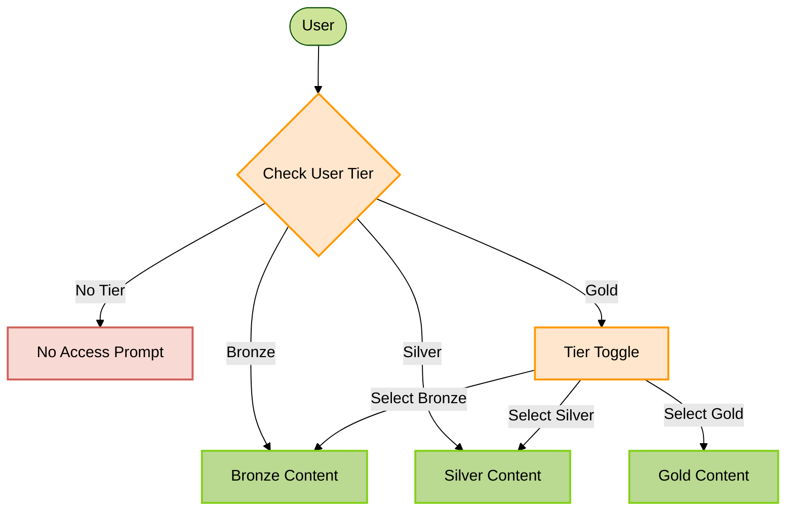
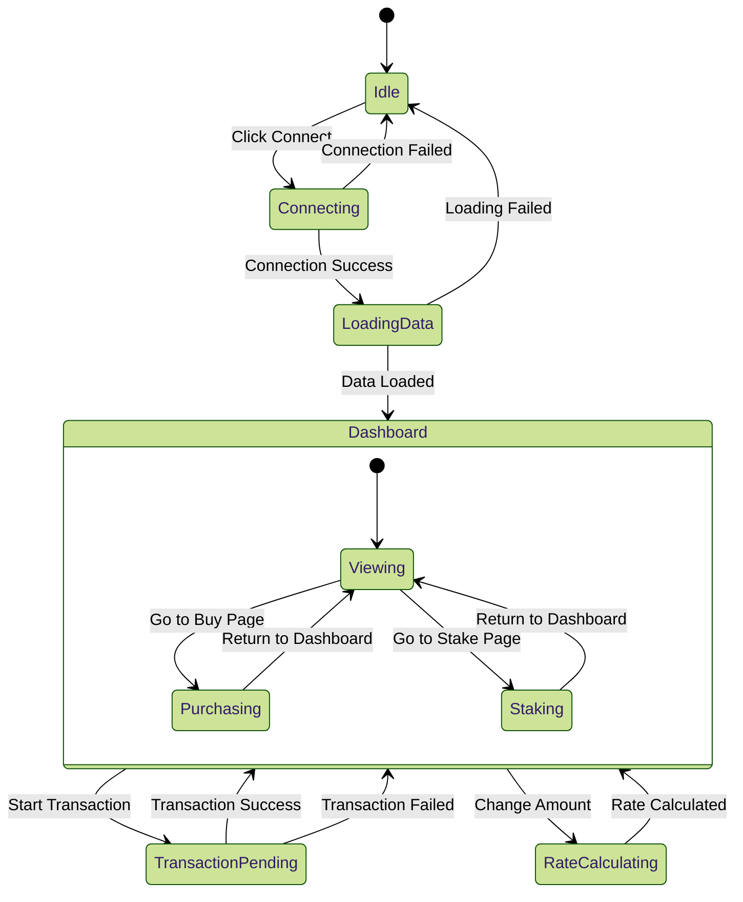
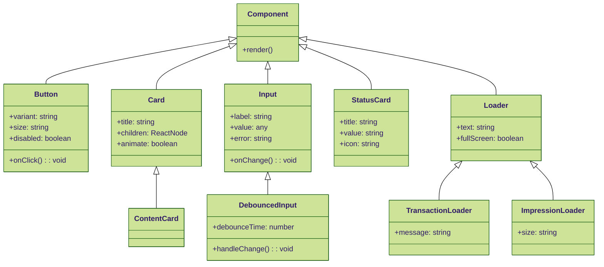
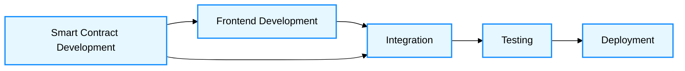

# InsightTiers: Architecture & Implementation

## System Architecture

InsightTiers is built as a modern React application that communicates with smart contracts deployed on the Polygon network. The system follows a client-centric architecture with blockchain interaction.



### Architecture Components

1. **Frontend Application (React)**
   - User interface for content access, token purchasing, and staking
   - Communicates with blockchain through ethers.js 
   - Manages application state and user session

2. **Smart Contracts (Solidity)**
   - Token Contract: ERC20 implementation with custom functionality
   - Staking Contract: Manages token staking and tier permissions
   - Minter Contract: Handles token sales for MATIC

3. **Web3 Provider Bridge**
   - Facilitates communication between frontend and blockchain
   - Handles wallet connections and transaction signing

4. **Content Delivery**
   - Tier-based content storage and delivery mechanism
   - Different content types (blogs, videos, PDFs) for different tiers

## Smart Contract Architecture

The three smart contracts work together to create the complete system:



## React Component Architecture

We designed the component structure following the Atomic Design methodology with a focus on reusability and separation of concerns:



### Custom Hooks Flow

The application leverages several custom hooks to encapsulate and reuse logic:



#### `useWallet`

This hook manages wallet connection and blockchain state:

```javascript
// src/hooks/useWallet.js
export function useWallet() {
  const [connected, setConnected] = useState(false);
  const [loading, setLoading] = useState(false);
  const [dataLoading, setDataLoading] = useState(false);
  const [account, setAccount] = useState(null);
  const [provider, setProvider] = useState(null);
  const [signer, setSigner] = useState(null);
  const [walletBalance, setWalletBalance] = useState(0);
  const [stakedAmount, setStakedAmount] = useState(0);
  const [userTier, setUserTier] = useState(0);
  
  // Connection logic
  const connectWallet = async () => {
    // Implementation details
  };
  
  // Data fetching logic
  const fetchUserData = async () => {
    // Implementation details
  };
  
  // Event listeners for wallet changes
  useEffect(() => {
    // Implementation details
  }, []);
  
  return {
    connected,
    loading,
    dataLoading,
    account,
    // other values and functions
  };
}
```

Key aspects:
- Maintains wallet connection state
- Provides methods for connecting/disconnecting wallet
- Fetches user blockchain data (balances, tiers)
- Handles wallet events (account changes, disconnections)

#### `useDebounce`

Used to prevent excessive blockchain calls when user input changes rapidly:

```javascript
// src/hooks/useDebounce.js
export function useDebounce(value, delay) {
  const [debouncedValue, setDebouncedValue] = useState(value);

  useEffect(() => {
    const handler = setTimeout(() => {
      setDebouncedValue(value);
    }, delay);

    return () => {
      clearTimeout(handler);
    };
  }, [value, delay]);

  return debouncedValue;
}
```

This hook is particularly important for blockchain applications as each call can be costly in terms of performance and potentially gas fees.

## State Management

We use React's built-in state management through hooks rather than external libraries like Redux or MobX. This decision was made because:

1. The application state is fairly hierarchical
2. Most state is scoped to specific components
3. Only a few pieces of state need to be shared globally (wallet connection, user tier)



State management approach:
- Global states are lifted to the App component and passed down via props
- Component-specific states remain local to their components
- Custom hooks encapsulate related state and logic (e.g., wallet connection)

## Web3 Integration

### Transaction Flow

The application implements a robust transaction flow:



### Example Transaction Code

```javascript
const stakeTokens = async () => {
  setIsTransacting(true);
  try {
    // Pre-transaction validation
    if (stakeAmount > walletBalance) {
      throw new Error("Insufficient balance");
    }
    
    // Transaction submission
    const stakeTx = await stakingContract.stake(amount);
    
    // Waiting for confirmation
    await stakeTx.wait();
    
    // Post-transaction updates
    await fetchUserData(provider, signer, account);
    
  } catch (error) {
    // Error handling
    console.error("Staking error:", error);
    alert("Failed to stake tokens: " + error.message);
  } finally {
    setIsTransacting(false);
  }
};
```

## Tier-Based Content System

The application implements a tier-based content delivery system:



```javascript
const ContentDisplay = ({ userTier }) => {
  // Content display logic based on tier
  if (userTier === 0) {
    return <BronzeContent />;
  } else if (userTier === 1) {
    return <SilverContent />;
  } else if (userTier >= 2) {
    return <TierToggle userTier={userTier} />;
  } else {
    return <NoAccessPrompt />;
  }
};
```

## Loading States Visual Flow

The application implements several loading states to provide clear feedback during blockchain operations:



## UI Component Hierarchy

Visual representation of component relationships:



## Responsive Design

The application uses Tailwind CSS for responsive design. Here's a visual representation of how components adapt to different screen sizes:

```
┌─────────────────────────────────────────────┐
│                   Mobile                    │
├─────────────────────────────────────────────┤
│ ┌─────────────────────────────────────────┐ │
│ │               Status Card 1             │ │
│ └─────────────────────────────────────────┘ │
│ ┌─────────────────────────────────────────┐ │
│ │               Status Card 2             │ │
│ └─────────────────────────────────────────┘ │
│ ┌─────────────────────────────────────────┐ │
│ │               Status Card 3             │ │
│ └─────────────────────────────────────────┘ │
│                                             │
│ ┌─────────────────────────────────────────┐ │
│ │                                         │ │
│ │                                         │ │
│ │              Content Area               │ │
│ │                                         │ │
│ │                                         │ │
│ └─────────────────────────────────────────┘ │
└─────────────────────────────────────────────┘

┌─────────────────────────────────────────────────────────────────────┐
│                              Desktop                                │
├─────────────────────────────────────────────────────────────────────┤
│ ┌───────────────┐ ┌───────────────┐ ┌───────────────┐               │
│ │ Status Card 1 │ │ Status Card 2 │ │ Status Card 3 │               │
│ └───────────────┘ └───────────────┘ └───────────────┘               │
│                                                                     │
│ ┌─────────────────────────────────────────────────────────────────┐ │
│ │                                                                 │ │
│ │                                                                 │ │
│ │                          Content Area                           │ │
│ │                                                                 │ │
│ │                                                                 │ │
│ └─────────────────────────────────────────────────────────────────┘ │
└─────────────────────────────────────────────────────────────────────┘
```

Implemented using Tailwind's responsive classes:

```jsx
<div className="grid grid-cols-1 md:grid-cols-3 gap-6">
  <StatusCard title="Wallet Balance" value={walletBalance} />
  <StatusCard title="Staked Amount" value={stakedAmount} />
  <StatusCard title="Current Tier" value={getTierName(userTier)} />
</div>
```

## Loading Animations

The application features custom loading animations for different contexts:

### Transaction Loader
Visual representation of the transaction loader with animated elements:

```
┌───────────────────────────────────────────┐
│                                           │
│                 ╭───────╮                 │
│              ╭──┤       ├──╮              │
│          ╭───┤  │       │  ├───╮          │
│         ╭┤   │  │   ◇   │  │   ├╮         │
│         ││   │  │       │  │   ││         │
│         ╰┤   │  │       │  │   ├╯         │
│          ╰───┤  │       │  ├───╯          │
│              ╰──┤       ├──╯              │
│                 ╰───────╯                 │
│                                           │
│        Processing Transaction...          │
│                                           │
│   Please confirm in your wallet and wait  │
│           for confirmation                │
│                                           │
└───────────────────────────────────────────┘
```

### Rate Calculation Indicator
Inline loading animation for real-time calculations:

```jsx
{isLoadingRate ? (
  <div className="flex items-center">
    <div className="w-4 h-4 border-2 border-indigo-500 border-t-transparent rounded-full animate-spin mr-2"></div>
    <span className="text-gray-500">Calculating...</span>
  </div>
) : (
  <span className="font-bold">{parseFloat(expectedTokens).toFixed(2)} INSIGHT</span>
)}
```

## Development Workflow

The project uses a structured development workflow:



1. **Smart Contract Development**: Write, test, and deploy contracts using solidity and foundry
2. **Frontend Development**: Build UI components and pages
3. **Integration**: Connect frontend to deployed contracts
4. **Testing**: Comprehensive testing in testnet environment
5. **Deployment**: Deploy to production environment

## Conclusion

InsightTiers demonstrates a modern approach to building decentralized applications with React. By leveraging custom hooks, component composition, and effective state management, it creates a seamless user experience despite the complexities of blockchain interactions.

